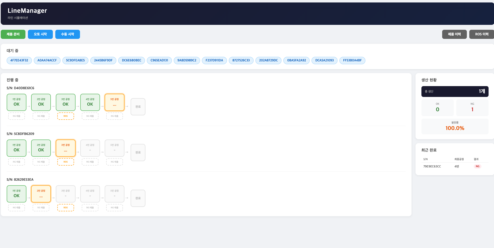

# LineManager
> 라인 시뮬레이션

## 프로젝트 소개

머신비전 엔지니어로 근무하며 직접 경험한 **생산라인 공정 흐름**, **ROS(재판정 시스템)**, **NG 배출 로직**을 Java 백엔드로 구현한 프로젝트입니다.

현장에서 쌓은 지식을 바탕으로 실제 공장 라인의 동작 방식을 최대한 유사하게 재현하였으며, 비동기 처리, 동적 쿼리, 계층형 아키텍처 등 백엔드 핵심 개념을 직접 적용했습니다.



---

## 기술 스택

| 분류 | 기술 |
|---|---|
| Backend | Java 21, Spring Boot 4.1 |
| ORM | Spring Data JPA, Hibernate |
| 동적 쿼리 | QueryDSL 5.1 |
| View | Thymeleaf |
| DB | H2 (In-Memory) |
| Build | Gradle |

---

## 주요 기능

- **라인 시뮬레이션**: 제품이 1번~5번 공정을 순차적으로 흐르며 각 공정에서 OK/NG 랜덤 판정
- **오토/수동 모드**: 대기 큐의 제품을 자동 / 수동으로 처리
- **ROS(재판정 시스템)**: 3번 공정 NG 발생 시 작업자가 수동으로 OK/NG 최종 판정
- **생산 통계**: 총 생산량, OK/NG 수량, 불량률 실시간 표시
- **이력 조회**: 공정 이력 및 ROS 이력을 동적 필터(S/N, 공정번호, 결과)로 검색 + 페이징

---

## 기술적 고민

### 1. ROS NG 처리 — ProcessLog 생성 여부
3번 공정에서 NG 발생 후 ROS에서 최종결과 NG 판정 시, 4번 공정의 NG 배출구로 이동하는 것을 표현해야 했습니다.

처음에는 ProcessLog(4번)를 생성했지만 실제로는 4번 공정 검사를 수행하지 않았기 때문에 이력에 남기는 것이 이론상 잘못되었습니다.

**해결**: ProcessLog 생성 없이 `rosDecision` 플래그를 DTO에 추가하여 화면에서 4번 NG 배출구만 활성화하는 방식으로 처리했습니다.

### 2. 비동기 처리 (@Async)
공정 흐름은 각 공정마다 5초의 처리 시간이 필요하여 동기로 실행 시 UI가 멈추는 문제가 있었습니다.

`@Async`로 별도 스레드에서 공정을 처리하고 오토 모드의 `volatile boolean autoRunning` 플래그로 멀티스레드 환경에서 안전하게 상태를 공유했습니다.

### 3. 동적 쿼리 — CriteriaBuilder → QueryDSL
이력 조회 시 S/N, 공정번호, 결과 조건이 선택적으로 적용되어 동적 쿼리가 필요했습니다.

처음 JPA 표준인 CriteriaBuilder로 구현했으나 문자열 오타를 컴파일 에러로 잡을 수 없었습니다.

**해결**: QueryDSL로 전환하여 타입 안전한 동적 쿼리를 구현했습니다.

### 4. 컨트롤러 관심사 분리
초기에 컨트롤러에 DB 조회, 통계 계산, DTO 변환 로직이 혼재하여 단일 책임 원칙을 위반했습니다.

**해결**: `HomeService`를 도입하여 비즈니스 로직을 서비스 레이어로 분리, 컨트롤러는 요청/응답만 담당하도록 개선했습니다.

---

## ERD

```
Product (제품)
├── id (PK)
├── serialNumber (unique)
├── status (WAITING / RUNNING / DONE)
├── finalResult (OK / NG / INIT)
├── currentProcessNo
├── createdAt
└── completedAt

ProcessLog (공정 이력)
├── id (PK)
├── product_id (FK → Product) [N:1]
├── processNo (1~5)
├── result (OK / NG / INIT)
├── processedAt
└── completedAt

RosLog (ROS 이력)
├── id (PK)
├── product_id (FK → Product) [1:1]
├── operatorDecision (OK / NG / INIT)
├── createdAt
└── completedAt
```

---

## 실행 방법

```bash
git clone https://github.com/taeyeonjang/linemanager.git
cd linemanager
# macOS / Linux
./gradlew bootRun

# Windows
gradlew bootRun
```

브라우저에서 `http://localhost:8080` 접속
